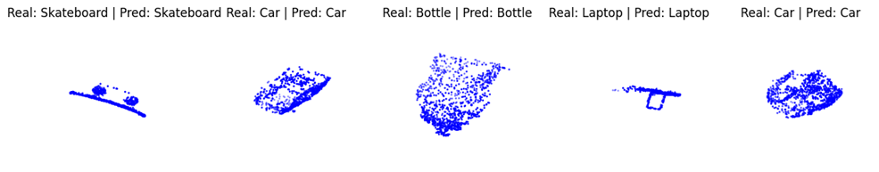
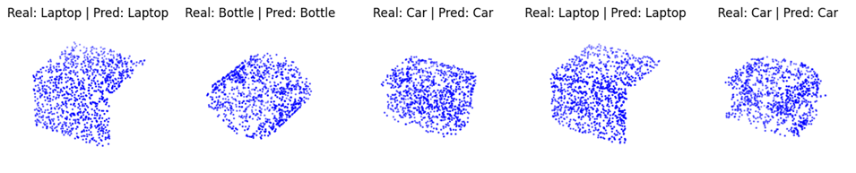

# PointNetWithCO3DandShapeNet
Entrenamiento de la red neuronal PointNet sobre los datasets ShapeNet y CO3D 

El modelo adquiere un accuracy de alrededor de 90% en validación sobre el dataset CO3D.

El modelo adquiere un accuracy de alrededor de 97% en validación sobre el dataset ShapeNet.

